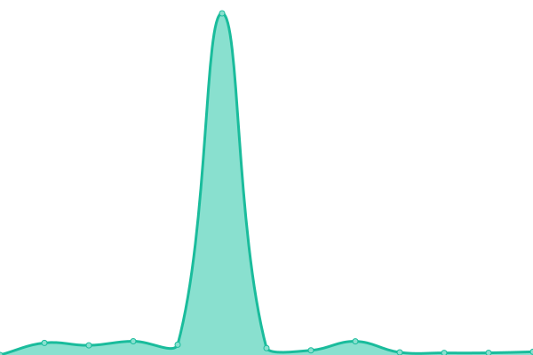

# [📈 Live Status](https://Cloudesire.github.io/status): <!--live status--> **🟩 All systems operational**

This repository contains the open-source uptime monitor and status page for [cloudesire](https://www.eng.it/en/our-platforms-solutions/cloudesire), powered by [Upptime](https://github.com/upptime/upptime).

With [Upptime](https://upptime.js.org), you can get your own unlimited and free uptime monitor and status page, powered entirely by a GitHub repository. We use [Issues](https://github.com/Cloudesire/status/issues) as incident reports, [Actions](https://github.com/Cloudesire/status/actions) as uptime monitors, and [Pages](https://Cloudesire.github.io/status) for the status page.

<!--start: status pages-->
<!-- This summary is generated by Upptime (https://github.com/upptime/upptime) -->
<!-- Do not edit this manually, your changes will be overwritten -->
<!-- prettier-ignore -->
| URL | Status | History | Response Time | Uptime |
| --- | ------ | ------- | ------------- | ------ |
|  [https://marketplace.cloudeng.it](https://marketplace.cloudeng.it) | 🟩 Up | [https-marketplace-cloudeng-it.yml](https://github.com/ClouDesire/status/commits/HEAD/history/https-marketplace-cloudeng-it.yml) | 

 867ms
     
 | 

<a href="https://Cloudesire.github.io/status/history/https-marketplace-cloudeng-it">100.00%</a>
    

|  [https://backend-staging-eng.cloudesire.com](https://backend-staging-eng.cloudesire.com/api/version) | 🟩 Up | [https-backend-staging-eng-cloudesire-com.yml](https://github.com/ClouDesire/status/commits/HEAD/history/https-backend-staging-eng-cloudesire-com.yml) | 

 357ms
     
 | 

<a href="https://Cloudesire.github.io/status/history/https-backend-staging-eng-cloudesire-com">100.00%</a>
    

|  [https://vc2.cloudeng.it](https://vc2.cloudeng.it) | 🟩 Up | [https-vc2-cloudeng-it.yml](https://github.com/ClouDesire/status/commits/HEAD/history/https-vc2-cloudeng-it.yml) | 

 1029ms
     
 | 

<a href="https://Cloudesire.github.io/status/history/https-vc2-cloudeng-it">100.00%</a>
    

<!--end: status pages-->

[**Visit our status website →**](https://Cloudesire.github.io/status)

## 📄 License

- Powered by: [Upptime](https://github.com/upptime/upptime)
- Code: [MIT](./LICENSE) © [Anand Chowdhary](https://anandchowdhary.com), supported by [Pabio](https://pabio.com)
- Data in the `./history` directory: [Open Database License](https://opendatacommons.org/licenses/odbl/1-0/)
